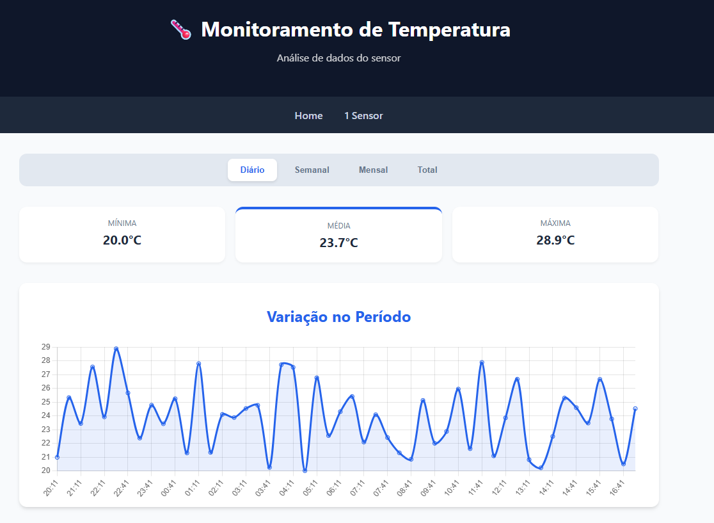
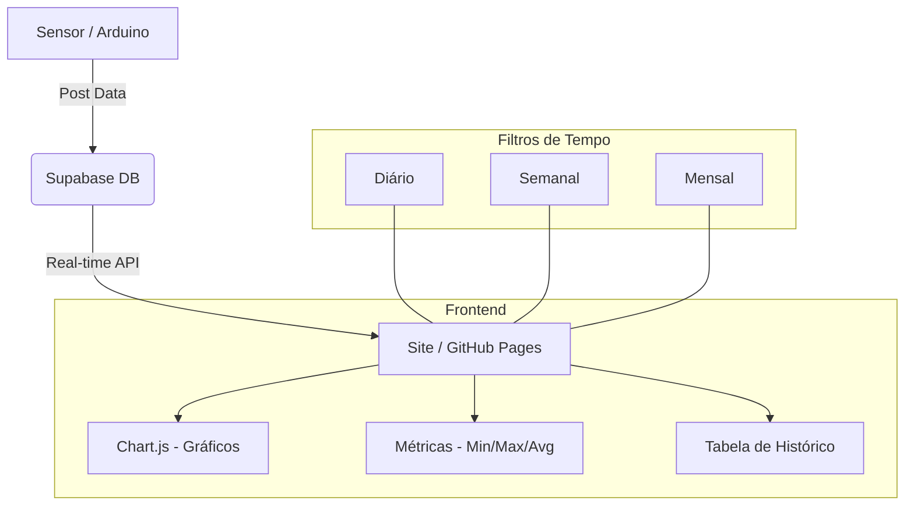

# 🌡️ Lab Temperature Monitor

Sistema de monitoramento térmico em tempo real integrado com **Supabase** e **Chart.js**.

## 📸 Visualização do Projeto

> **[INSERIR PRINT DO SEU SITE AQUI]**
> *(Fernando: Recomendo tirar um print da tela `sensor1.html` com os gráficos funcionando e salvar como `screenshot.png` nesta pasta para que ele apareça abaixo)*

## 🚀 Funcionalidades

- **Monitoramento em Tempo Real:** Conexão direta com banco de dados via Supabase.
- **Gráficos Interativos:** Visualização de tendências com Chart.js.
- **Análise por Período:** Filtros Diário, Semanal e Mensal.
- **Estatísticas Rápidas:** Cálculo automático de Mínima, Média e Máxima.
- **Interface Responsiva:** Design moderno adaptado para dispositivos móveis e desktop.

## 🛠️ Arquitetura do Sistema

## 📋 Como Configurar

1. **Banco de Dados:**
   - Crie uma tabela `temperatura_quarto` no Supabase com as colunas `id`, `created_at` e `temperatura`.
   - Habilite o RLS e a política de leitura pública (conforme `ARCHITECTURE.md`).

2. **Frontend:**
   - Insira sua `SUPABASE_URL` e `ANON_KEY` no arquivo `sensor1.html`.
   - Abra o `index.html` ou hospede no GitHub Pages.

---
Desenvolvido por **Fernando** | 2026
