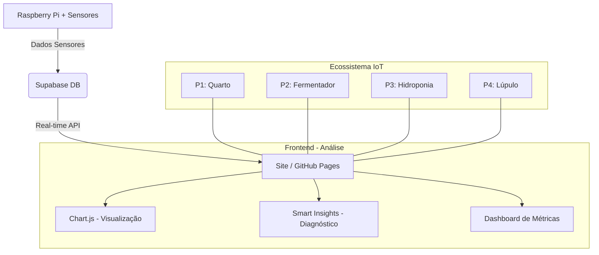

# 🌡️ Lab Environmental & System Monitor

Sistema avançado de monitoramento ambiental e de saúde de hardware integrado com **Supabase**, **Chart.js** e **Análise Automática de Dados**.

## 🚀 Funcionalidades Principais

- **Monitoramento Ambiental:** Temperatura (°C) e Humidade (%) em tempo real.
- **Saúde do Sistema:** Monitoramento da temperatura da CPU do Raspberry Pi.
- **💡 Insights Inteligentes:** Motor de análise que gera diagnósticos automáticos.
- **Gráficos Multi-Eixo:** Visualização de 3 variáveis simultâneas.
- **Filtros Temporais:** Alternância dinâmica entre visões Diária, Semanal e Mensal.
- **Ecossistema Escalável:** Preparado para múltiplos projetos de automação.

## 🗺️ Roadmap de Expansão

1.  **Projeto 1:** Monitoramento Ambiental do Quarto (Concluído).
2.  **Projeto 2:** Controle Térmico de Fermentador (Em desenvolvimento).
3.  **Projeto 3:** Hidroponia Inteligente (Planejamento).
4.  **Projeto 4:** Automação de Irrigação em Plantação de Lúpulo (Roadmap).

## 🛠️ Arquitetura do Sistema

## 📋 Como Configurar

1. **Banco de Dados:**
   - Configure a tabela `temperatura_quarto` no Supabase (ver `ARCHITECTURE.md`).
   - Aplique as políticas de RLS para acesso público.

2. **Frontend:**
   - Configure sua `SUPABASE_URL` e `ANON_KEY` no arquivo `sensor1.html`.
   - Hospede no GitHub Pages para acesso remoto.

---
Desenvolvido por **Fernando** | 2026
