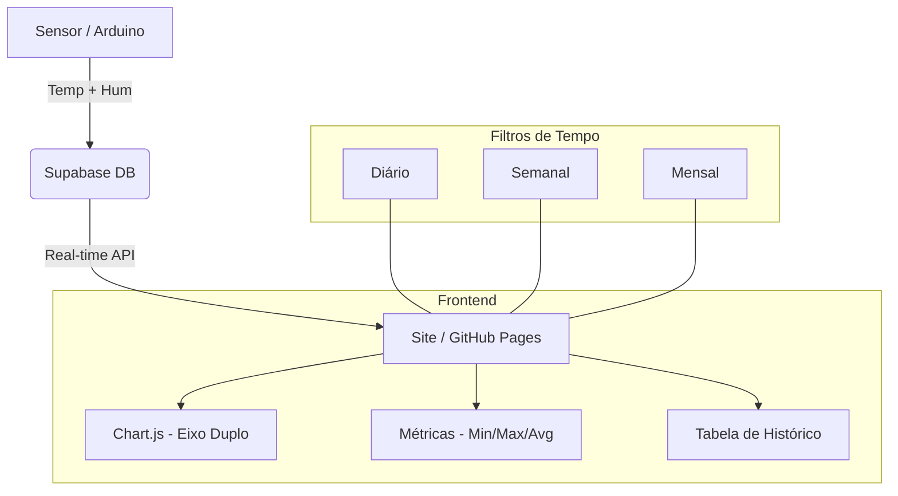

# 🌡️ Lab Environmental Monitor

Sistema de monitoramento térmico e de humidade em tempo real integrado com **Supabase** e **Chart.js**.

## 📸 Visualização do Projeto

> **[INSERIR PRINT DO SEU SITE AQUI]**
> *(Fernando: Recomendo tirar um print da tela `sensor1.html` com os gráficos funcionando e salvar como `screenshot.png` nesta pasta para que ele apareça abaixo)*

## 🚀 Funcionalidades

- **Monitoramento Ambiental:** Temperatura (°C) e Humidade (%) em tempo real.
- **Gráficos de Eixo Duplo:** Visualização simultânea de múltiplas variáveis (Temp e Hum).
- **Análise por Período:** Filtros Diário, Semanal e Mensal.
- **Estatísticas Rápidas:** Dashboards com médias, picos e valores atuais.
- **Interface Responsiva:** Design moderno adaptado para dispositivos móveis e desktop.

## 🛠️ Arquitetura do Sistema

## 📋 Como Configurar

1. **Banco de Dados:**
   - Crie uma tabela `temperatura_quarto` no Supabase com as colunas `id`, `created_at`, `temperatura` e `humidade`.
   - Habilite o RLS e a política de leitura pública (conforme `ARCHITECTURE.md`).

2. **Frontend:**
   - Insira sua `SUPABASE_URL` e `ANON_KEY` no arquivo `sensor1.html`.
   - Abra o `index.html` ou hospede no GitHub Pages.

---
Desenvolvido por **Fernando** | 2026
